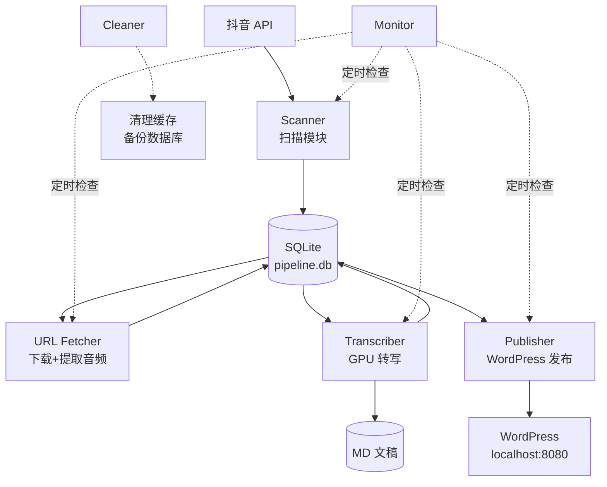
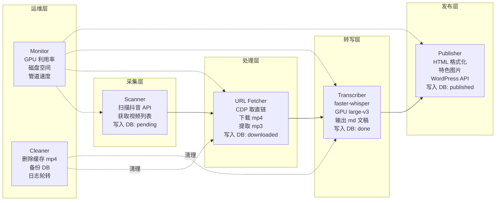
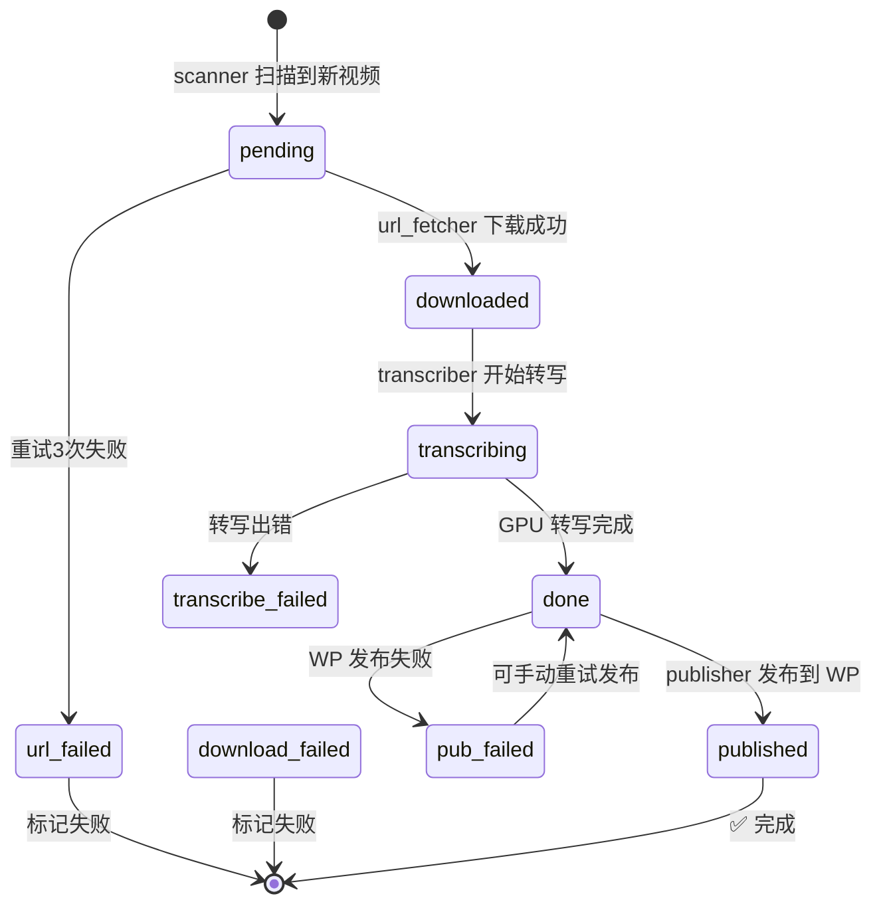
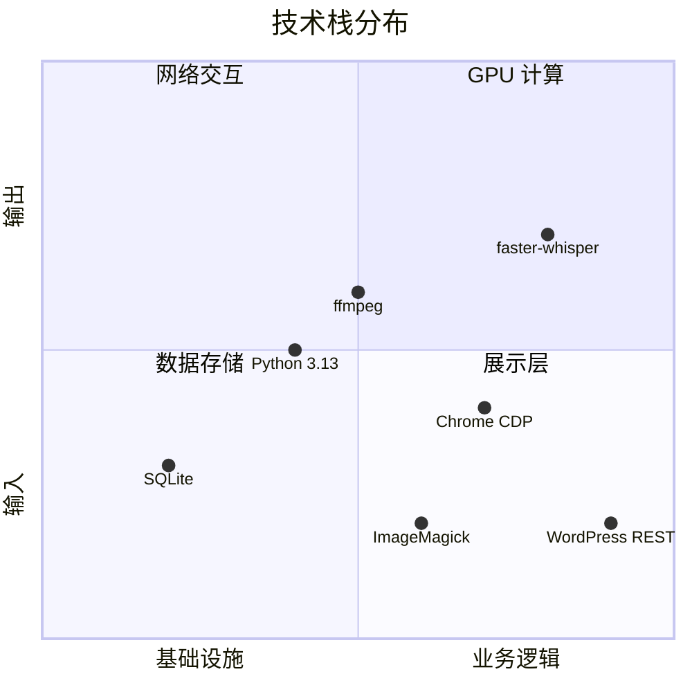
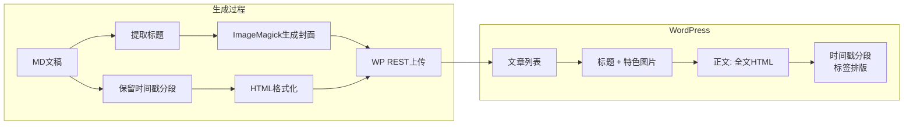

# V4 抖音转写管道 — Obsidian 可视化

> 项目根目录：`~/douyin_api/`  
> 当前版本：v4.0

---

## 1. 数据流总览



---

## 2. 模块角色



---

## 3. 数据库状态流转



---

## 4. 技术栈



---

## 5. 配置文件结构

```
config/config.toml
├── [general]          ─── 项目路径、日志目录
├── [database]         ─── SQLite 路径
├── [accounts]         ─── 账号列表（可追加）
│   ├── 棱镜Talk
│   ├── 小Lin说
│   ├── 金灿荣教授
│   └── 王德峰
├── [scanner]          ─── 扫描间隔
├── [transcriber]      ─── 模型、精度、并发
├── [chrome]           ─── CDP 地址
├── [cookies]          ─── Cookie 文件路径
├── [wordpress]        ─── WP 地址/账号
├── [cleaner]          ─── 缓存上限
└── [monitor]          ─── 检查间隔
```

---

## 6. 文件组织结构

```
versions/v4/
├── modules/            ← 7个执行模块
│   ├── scanner.py
│   ├── url_fetcher.py
│   ├── transcriber.py       (管理器)
│   ├── transcriber_worker.py (GPU 工作进程)
│   ├── publisher.py
│   ├── monitor.py
│   └── cleaner.py
├── lib/                ← 公共库
│   ├── db.py           ← 数据库层
│   ├── config.py       ← 配置层
│   └── wordpress.py    ← WP API 层
├── config/
│   └── config.toml     ← 所有配置
├── database/
│   └── pipeline.db     ← SQLite (WAL模式)
├── logs/               ← 模块日志 (10MB轮转)
├── output/             ← 转写文稿
├── tmp_cache/          ← mp4/mp3缓存
├── data/
│   └── v3_done_ids.json ← V3去重列表
└── scripts/
    ├── start_v4.sh     ← 一键启动
    └── status.sh       ← 状态查看
```

---

## 7. 关键路径

> [!info] 数据库
> `~/douyin_api/versions/v4/database/pipeline.db`
> 所有模块通过它协作（状态机模式）

> [!info] 日志
> `~/douyin_api/versions/v4/logs/*.log`
> 每个模块独立日志，自动轮转

> [!info] 去重
> `~/douyin_api/versions/v4/data/v3_done_ids.json`
> 9255个V3已完成ID，scanner据此跳过

> [!info] 缓存
> `~/douyin_api/versions/v4/tmp_cache/`
> cleaner 自动清理超过 7 天的缓存

---

## 8. 发布文章展示



---

## 9. 当前管道状态

> [!note] 最近状态（2026-05-05 20:04）
> - 已发布：164 篇
> - 待处理：337 个
> - GPU 利用率：94%
> - 总转写字数：11.8 万字
> - Chrome CDP：在线

---

## 10. 相关链接

- [[V4_技术说明|完整技术文档]]
- [[VERSIONS|版本历史]]
- [[ARCHITECTURE|架构设计]]

---

*— 用 [Obsidian](https://obsidian.md/) 打开本文件可渲染所有 Mermaid 图表 —*
